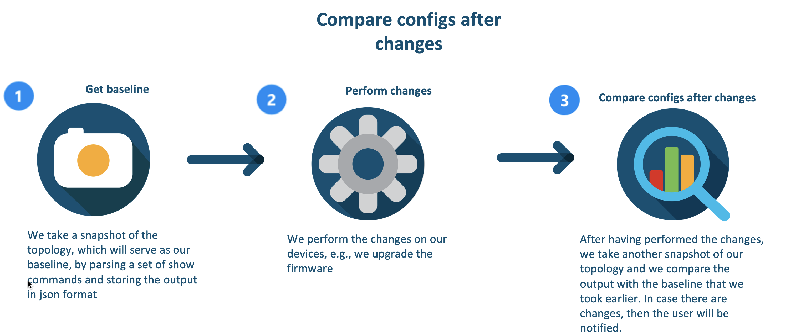
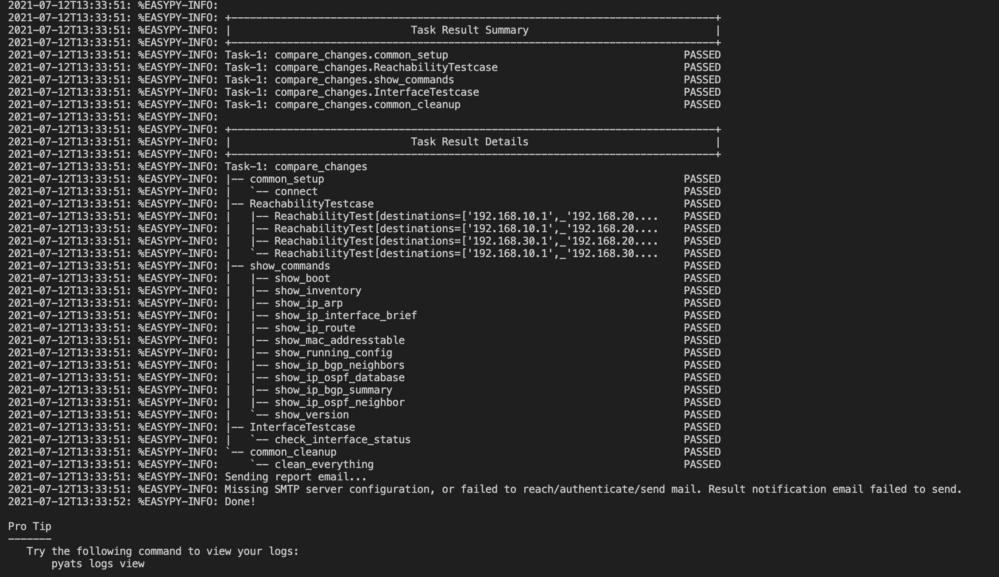
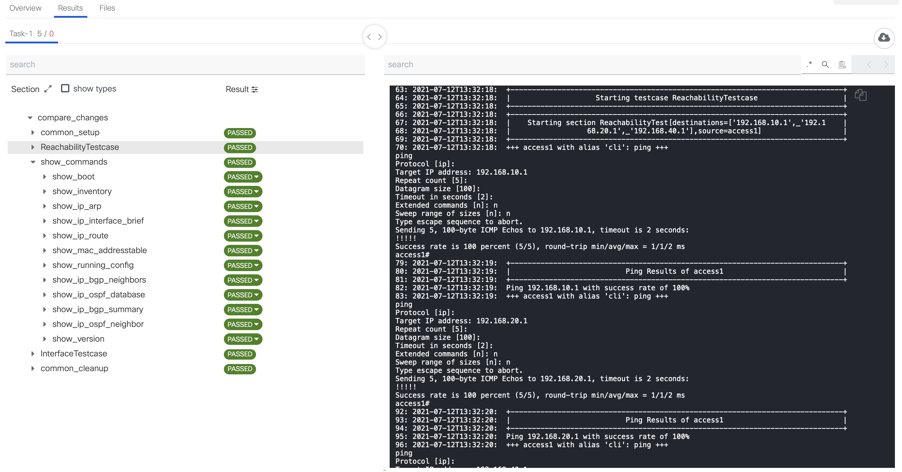

# GVE DevNet pyATS Config Diff Comparison
Many customers would like to start automating their testing. In this PoV, we are going to show how to use CML and pyATS for automated testing. In particular, we are going to showcase three automated testcases. In the first testcase, we test the reachability of the devices. In the second testcase, we compare the changes with the baseline through parsing ```show``` commands and in case of changes, the testcase fails. In the last testcase, we parse a particular ```show``` command and check that it satisfies the requirements that we have set.


## Contacts
* Simon Fang (sifang@cisco.com)
* Joep Remkes (joremkes@cisco.com)
* Alvaro Escribano (alvescri@cisco.com)

## Solution Components
* pyATS
* CML

## Configuration

### Testbed
In order to use pyATS, we have to create a testbed file, which contains the information on how to connect to the devices. The testbed file will include include the following elements:

* IP address
* Port
* Credentials
* Protocol (SSH, Telnet)
* Type of device

An example testbed file has been provided in ```testbed_example.yaml```. If you want to read more on how to create a testbed file, then consult the documentation in the following link: 

> https://pubhub.devnetcloud.com/media/pyats-getting-started/docs/quickstart/manageconnections.html#creating-testbed-yaml-file

### Environment variables
We have also created a separate file with the commands that you would like to test and the destinations for reachability. For the access devices, we have the following commands:

``` python
# Step 1: Specify the commands that you would like to test on the access devices
access_commands = [
    "show ip arp",
    "show ip interface brief",
    "show mac address-table",
    "show version",
    "show inventory",
    "show running-config",
    "show boot",
    "show ip route",
    "show ip ospf neighbor",
    "show ip ospf database"
]
```
And for the core devices, we have the following commands:

``` python
# Step 2: Specify the commands that you would like to test on the access devices
core_commands = [
    "show ip arp",
    "show ip interface brief",
    "show mac address-table",
    "show version",
    "show inventory",
    "show running-config",
    "show boot",
    "show ip route",
    "show ip ospf neighbor",
    "show ip bgp summary",
    "show ip bgp neighbors",
    "show ip ospf database"
]
```

We can change these commands in accordance with the test plan that you would like to create. Afterwards, we create a dictionary with the devices as a key and the commands as the value:

```python
# Step 3: Create a dictionary with the devices as a key and the commands as the value
device_commands = {}

device_commands['access1'] = access_commands
device_commands['access2'] = access_commands
device_commands['core1'] = core_commands
device_commands['core2'] = core_commands
```

And we specify the devices that we would like to test:

```python 
# Step 4: Specify all the devices that you would like to test in your topology
devices = ["access1", "access2", "core1", "core2"]
```

Last, we have also included the destionations that you would like to test for reachability

```python
# Step 5: Specify the destinations in a list that you would like to test for reachability
destinations = [
    [""], #access1
    [""], #access2
    [""], #core1
    [""]  #core2
]
```

And add the testbed file name for the script that obtains the baseline:

```python
# Step 6: Specify the testbed filename
testbed_filename = ''
```

## Installation

The following commands are executed in the terminal.

1. Create and activate a virtual environment for the project:
   
        #WINDOWS:
        $ py -3 -m venv [add_name_of_virtual_environment_here] 
        $ [add_name_of_virtual_environment_here]/Scripts/activate.bat
        #MAC:
        $ python3 -m venv [add_name_of_virtual_environment_here] 
        $ source [add_name_of_virtual_environment_here]/bin/activate
        
> For more information about virtual environments, please click [here](https://docs.python.org/3/tutorial/venv.html)


2. Access the created virtual environment folder

        $ cd [add_name_of_virtual_environment_here]

3. Clone this repository

        $ git clone [add_link_to_repository_here]
        
4. Access the folder `gve_devnet_pyats_config_diff_comparison`

        $ cd gve_devnet_pyats_config_diff_comparison
        
5. Create a testbed file. For an example, please see the `testbed_example.yaml`

6. Update the `env_var.py` file in accordance with your testplan and add the devices from your topology. 
        
7. Install the dependencies:

        $ pip install -r requirements.txt
        
## Usage
1. We obtain a baseline with the script `get_baseline.py`

        $ python get_baseline.py
2. Make changes to the devices, e.g., update the firmware of the routers

3. Perform an automated test using pyATS. We will automatically go through the pre-defined testcases. 

        $ easypy test_scripts/compare_changes_job.py -testbed_file [add_name_of_testbed_file]

4. View the logs

        $ pyats logs view


## Workflow
In this PoV, we will follow the following workflow: 

1. Obtain a baseline
2. Make changes to devices
3. Compare configuration files after the changes 





# Screenshots
Below is a screenshot of the output of an automated test with pyATS: 


And below there is a screenshot of the pyATS GUI, where you can see the results of the current and previous tests:




### LICENSE

Provided under Cisco Sample Code License, for details see [LICENSE](LICENSE.md)

### CODE_OF_CONDUCT

Our code of conduct is available [here](CODE_OF_CONDUCT.md)

### CONTRIBUTING

See our contributing guidelines [here](CONTRIBUTING.md)

#### DISCLAIMER:
<b>Please note:</b> This script is meant for demo purposes only. All tools/ scripts in this repo are released for use "AS IS" without any warranties of any kind, including, but not limited to their installation, use, or performance. Any use of these scripts and tools is at your own risk. There is no guarantee that they have been through thorough testing in a comparable environment and we are not responsible for any damage or data loss incurred with their use.
You are responsible for reviewing and testing any scripts you run thoroughly before use in any non-testing environment.
